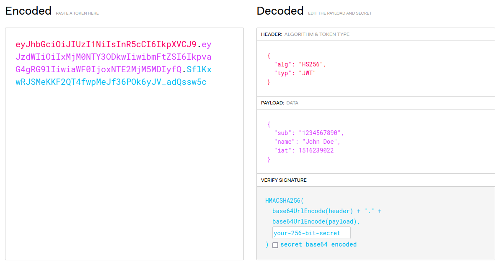

# Tokens con Flask



1. Creamos a estructura do proxecto
    - python -m venv venv
    - ./venv/Scripts/activate
    - pip install flask
    - pip list

>*pip list* serve para mostrar as instalacións 
#
2. Creamos o arquivo **main.py**
#
3. O token atoparase no arquivo .env
    - pip install python-dotenv
    - pip install flask-jwt-extended

#
4. Creamos o arquivo .env e definimos a clave secreta:
```python
SECRET_KEY = 1635gwkbo97f
```
#
5. Realizamos as importacións necesarias no arquivo main.py:

```python
from flask import Flask, jsonify
from flask_jwt_extended import create_access_token, JWTManager
import os
from detenv import load_dotenv
import datetime

load_dotenv()

app = Flask(__name__)

if __name__ == '__main__':
    app.run(debug=True)
```
#
6. Configuramos o token no mesmo arquivo:
```python
...

app = Flask(__name__)

app.config["JWT_SECRET_KEY"] = os.getenv('SECRET_KEY')
jwt = JWTManager(app)

@app.get("/token")
def crear_token():
    token_config = {
        'payload': 'pepe',
        'exp':datetime.datetime.utcnow() + datetime.timedelta(hours=1)
    }
    token = create_access_token(token_config)
    return jsonify({"token":token})

if __name__ == '__main__':
    app.run(debug=True)
```
#
7. Executamos o código e probamos que funcione correctamente. Diriximonos ao navegador e no localhost:5000/token comprobamos que se mostra o token. 
#
8. Podemos crear unha función que englobe o payload para unha mellor lectura do código. Para elo debaixo da declaración de jwt creamos a seguinte función:
```python
def obter_payload():
    payload = {
        'user':'pepe',
        'rol':'ADMIN'
    }
    return payload
```
Na liña de código de 'payload' da función crear_token sustituiremos 'pepe' por obter_payload(). Executamos e probamos no navegador que funcione correctamente.
#

## Proba cunha aplicación cliente:
1. Habilitaremos CORS, para elo instalarase para permitir un enlace cruzado de datos.
    - pip install flask-cors
    - pip list
#
2. Importamos cors:
```python
from flask_cors import CORS
```
#
3. Realizamos a configuración:
```python
...

app = Flask(__name__)

app.config['JSON_AS_ASCII'] = False
CORS(app)
```

Executamos o código e diriximonos a un arquivo index.html

#
4. Co seguinte código visualizaremos no navegador dende o index.html o token a través da consola
```html
<!DOCTYPE html>
<html lang="en">
<head>
    <meta charset="UTF-8">
    <meta http-equiv="X-UA-Compatible" content="IE=edge">
    <meta name="viewport" content="width=device-width, initial-scale=1.0">
    <title>Document</title>
</head>
<body>
    <script>
        fetch('http://localhost:5000/token')
            .then(response => response.json())
            .then(json => console.log(json))
    </script>
</body>
</html>
```
#
5. Almacenamos o token nunha sesión. Crearemos unha clave token que apunte ao token que o teremos na variable json.
```html
<!DOCTYPE html>
<html lang="en">
<head>
    <meta charset="UTF-8">
    <meta http-equiv="X-UA-Compatible" content="IE=edge">
    <meta name="viewport" content="width=device-width, initial-scale=1.0">
    <title>Document</title>
</head>
<body>
    <script>
        fetch('http://localhost:5000/token')
            .then(response => response.json())
            .then(json => {
                sessionStorage.setItem('token', json)
            })
    </script>
</body>
</html>
```
#
6. Convertiremos o token nun string.
```html
sessionStorage.setItem('token', String(json))
```
Dende a consola dirixímonos a Session Storage e aparecerá o token con caracteres alfanuméricos.
A maneira de pasar o token dende o front ao back non é polo corpo da petición (body) senon que é polos headers. Neste caso por uns headers especiais que son os de Authorization.